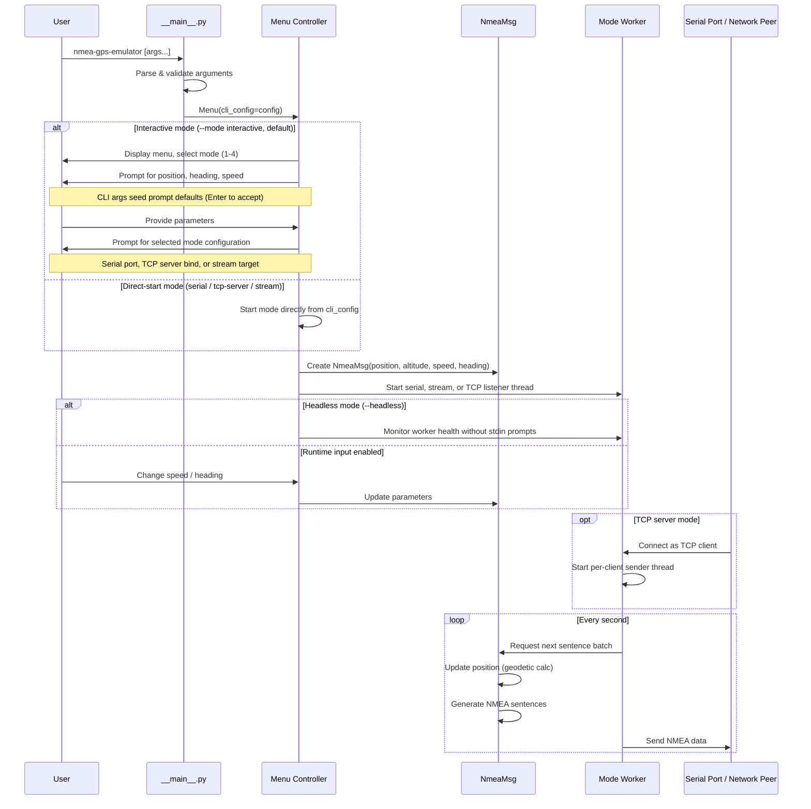

# NMEA-GPS Emulator

[](https://www.python.org/downloads/)
[](LICENSE)
[](https://github.com/luk-kop/nmea-gps-emulator/actions/workflows/ci.yml)
[](https://github.com/luk-kop/nmea-gps-emulator/actions/workflows/ci-multiplatform.yml)
[](https://github.com/luk-kop/nmea-gps-emulator/actions/workflows/codeql.yml)
[](https://github.com/luk-kop/nmea-gps-emulator/actions/workflows/release.yml)
[](https://codecov.io/gh/luk-kop/nmea-gps-emulator)
[](https://docs.astral.sh/uv/)

The **NMEA-GPS Emulator** is a simple script that emulates a GPS receiver (simulates unit's movement). Data generated by the script are sent to clients in **NMEA 0183** format.
This script can be useful for testing applications or systems that require some unit's GPS position data.

The **NMEA-GPS Emulator** script can be used in one of the following operating modes:

- NMEA TCP Stream (sends TCP packets to the specified client),
- NMEA UDP Stream (sends UDP packets to the specified client),
- NMEA TCP Server (the server waits for client connections, then sends TCP packets to the connected clients - max 10 connections)
- NMEA Serial (transmit serial data on specified RS port).

***

## Table of Contents

- [Features](#features)
- [How It Works](#how-it-works)
- [Getting Started](#getting-started)
- [Running the Application](#running-the-application)
- [Command-line Options](#command-line-options)
- [Contributing](#contributing)

***

## Features

- Generates standard NMEA 0183 sentences for a simulated moving GPS receiver.
- Supports four operating paths:
  - interactive menu mode for manual setup;
  - TCP server mode for serving up to 10 connected clients;
  - TCP or UDP stream mode for sending data to a configured target;
  - serial mode for transmitting data over a configured serial port.
- Accepts startup parameters for position, speed, heading, altitude, network target, protocol, serial port, and baudrate.
- Allows runtime speed and heading changes after transmission starts, unless `--headless` is enabled.
- Supports `--headless` foreground execution for supervisors, containers, and scripts that should not read from stdin after startup.
- Provides `--quiet` and `--verbose` output modes for automation and troubleshooting.
- Validates CLI inputs at startup, including compact GPS position format, heading, speed, IPv4 address, port, serial requirements, and baudrate choices.
- Updates position every second using WGS84 geodetic calculations from `pyproj`.
- Sends a complete NMEA sentence batch every second with checksums and simulated satellite/fix data.

List of NMEA sentences generated by **NMEA-GPS Emulator** script:

```text
GPGGA - Global Positioning System Fix Data
GPGLL - Position data: position fix, time of position fix, and status
GPRMC - Recommended minimum specific GPS/Transit data
GPGSA - GPS DOP and active satellites
GPGSV - GPS Satellites in view
GPHDT - True Heading
GPVTG - Track made good and ground speed
GPZDA - Date & Time
```

Output example:

```text
$GPGGA,173124.00,5430.000,N,01921.029,E,1,09,0.92,15.2,M,32.5,M,,*6C
$GPGSA,A,3,22,11,27,01,03,02,10,21,19,,,,1.56,0.92,1.25*02
$GPGSV,4,1,15,26,25,138,53,16,25,091,67,01,51,238,77,02,45,085,41*79
$GPGSV,4,2,15,03,38,312,01,30,68,187,37,11,22,049,44,09,67,076,71*77
$GPGSV,4,3,15,10,14,177,12,19,86,235,37,21,84,343,95,22,77,040,66*79
$GPGSV,4,4,15,08,50,177,60,06,81,336,46,27,63,209,83*4C
$GPGLL,5430.000,N,01921.029,E,173124.000,A,A*59
$GPRMC,173124.000,A,5430.000,N,01921.029,E,10.500,90.0,051121,,,A*65
$GPHDT,90.0,T*0C
$GPVTG,90.0,T,,M,10.5,N,19.4,K*51
$GPZDA,173124.000,05,11,2021,0,0*50
```

***

## How It Works

The emulator simulates realistic GPS receiver behavior through several key components:

### Application Flow



### Position Calculation

- Uses **pyproj** library for geodetic calculations on the WGS84 ellipsoid
- Calculates new positions based on current speed, heading, and time elapsed
- Converts between geographic coordinates (lat/lon) and projected coordinates for accurate distance calculations
- Updates position every second based on the unit's velocity vector

### NMEA Sentence Generation

- Generates 8 standard NMEA 0183 sentences with proper formatting
- Calculates XOR checksums for each sentence to ensure data integrity
- Simulates realistic GPS data including:
  - Satellite information (GPGSV) with pseudo-random satellite positions and signal strengths
  - Dilution of Precision (DOP) values for position accuracy estimation
  - Time synchronization with system clock

### Threading Architecture

- **Main thread**: Handles user input for interactive speed/course changes
- **Worker threads**: Manage client connections and data transmission
  - TCP Server mode: Accepts up to 10 concurrent client connections
  - TCP/UDP Stream mode: Maintains persistent connection to specified client
  - Serial mode: Transmits data via RS-232 serial port
- Thread-safe communication using events and locks for coordinated shutdown

### Data Transmission

- Sends complete NMEA sentence sets every second
- Automatically updates position before each transmission
- Supports interactive runtime modifications of speed and heading without interrupting data flow

***

## Getting Started

Below instructions will get you a copy of the project up and running on your local machine.

### Requirements

**Python 3.12 or higher is required.** If your system has an older Python version, you can use [pyenv](https://github.com/pyenv/pyenv) to install and manage multiple Python versions:

```bash
# Install Python 3.12 with pyenv
pyenv install 3.12
pyenv local 3.12  # Set Python 3.12 for this project
```

Development workflows use [uv](https://docs.astral.sh/uv/) for dependency syncing and command execution:

```bash
curl -LsSf https://astral.sh/uv/install.sh | sh
```

Python third party packages:

- [pyproj](https://pypi.org/project/pyproj/)
- [pyserial](https://pypi.org/project/pyserial/)
- [psutil](https://pypi.org/project/psutil/)

In order to use **NMEA Serial** mode correctly, it is necessary to use dedicated serial **null modem** cable.

On Linux systems you will probably need to change the permissions for the device matching your serial port before running the script.

```bash
# Example command for /dev/ttyUSB0 device
sudo chmod a+rw /dev/ttyUSB0
```

### Installation

#### Option 1: Install from wheel file (Recommended)

Download the wheel file from the [releases page](https://github.com/luk-kop/nmea-gps-emulator/releases) and install it:

```bash
python -m pip install nmea_gps_emulator-*.whl
```

#### Option 2: Development installation

```bash
git clone https://github.com/luk-kop/nmea-gps-emulator.git
cd nmea-gps-emulator
uv sync --extra dev
```

Common development commands:

| Command | Description |
| --- | --- |
| `make sync` | Create or update the uv environment with development dependencies. |
| `make test` | Run tests with coverage. |
| `make lint` | Run Ruff lint checks. |
| `make format` | Format Python files with Ruff. |
| `make typecheck` | Run mypy. |
| `make check` | Run lint, format check, type check, and tests. |
| `make build` | Build source and wheel distributions. |
| `make run` | Run the emulator from the local uv environment. Pass CLI options with `ARGS="..."`. |

Development run examples:

```bash
# Show CLI help
make run ARGS="--help"

# Start interactive mode with prompt defaults pre-seeded
make run ARGS='--position "4807N 01131E" --speed 12.5 --heading 90'

# Start TCP server mode
make run ARGS='--mode tcp-server --ip 0.0.0.0 --port 3000'

# Start TCP server mode without runtime stdin prompts
make run ARGS='--mode tcp-server --headless --ip 0.0.0.0 --port 3000'

# Send UDP stream data to a remote host
make run ARGS="--mode stream --protocol udp --ip 192.168.1.100 --port 5000"

# Run serial mode
make run ARGS="--mode serial --serial-port /dev/ttyUSB0 --baudrate 9600"
```

### Running the application

#### If installed from wheel file

```bash
nmea-gps-emulator
```

#### If using development installation

```bash
uv run python -m nmea_gps_emulator
```

#### Command-line options

The emulator can be launched in interactive mode (default) or non-interactive mode by specifying an operating mode and parameters via CLI arguments. All parameters have sensible defaults, so you only need to provide the ones you want to override.

```bash
nmea-gps-emulator [OPTIONS]
```

**General options:**

| Option | Short | Description | Default |
| --- | --- | --- | --- |
| `--help` | `-h` | Show help message and exit | |
| `--quiet` | `-q` | Suppress informational messages (only show errors and user prompts) | |
| `--verbose` | `-v` | Enable verbose output with detailed debug information | |
| `--mode` | `-m` | Operating mode: `serial`, `tcp-server`, `stream`, `interactive` | `interactive` |
| `--headless` | | Disable runtime stdin prompts after startup; requires `serial`, `tcp-server`, or `stream` mode | |

`--quiet` and `--verbose` are mutually exclusive and cannot be used together.

**Navigation parameters:**

| Option | Short | Description | Default |
| --- | --- | --- | --- |
| `--position` | `-p` | GPS position in compact format, e.g. `5430N 01920E` | `5430N 01920E` |
| `--speed` | `-s` | Speed in knots (0-999) | `0.0` |
| `--heading` | `-c` | Course in degrees (0-359) | `0.0` |
| `--altitude` | `-a` | Altitude in meters | `15.2` |

The position format is `DDMMH DDDMMH` where `DD`/`DDD` are degrees, `MM` are minutes, and `H` is the hemisphere (`N`/`S` for latitude, `E`/`W` for longitude). Latitude ranges from `0000N` to `9000N`/`S`, longitude from `00000E` to `18000E`/`W`.

**Network parameters (for `tcp-server` and `stream` modes):**

| Option | Description | Default |
| --- | --- | --- |
| `--ip` | IPv4 address (bind address for tcp-server, target for stream) | `127.0.0.1` |
| `--port` | Port number (1-65535) | `2020` |
| `--protocol` | Transport protocol: `tcp`, `udp` (stream mode only) | `tcp` |

**Serial parameters (for `serial` mode):**

| Option | Description | Default |
| --- | --- | --- |
| `--serial-port` | Serial device path, e.g. `/dev/ttyUSB0` or `COM1` (required for serial mode) | |
| `--baudrate` | Baudrate: `4800`, `9600`, `19200`, `38400`, `57600`, `115200` | `4800` |

**Usage examples:**

```bash
# Interactive mode (default) - shows menu and prompts for all inputs
nmea-gps-emulator

# Quiet mode - minimal output, useful for scripts or automation
nmea-gps-emulator --quiet

# Verbose mode - detailed diagnostic information for troubleshooting
nmea-gps-emulator --verbose

# TCP Server mode - listen on 0.0.0.0:3000 with custom position and speed
nmea-gps-emulator --mode tcp-server --ip 0.0.0.0 --port 3000 --position "4807N 01131E" --speed 12.5 --heading 90

# TCP Server mode without runtime stdin prompts, suitable for supervisors
nmea-gps-emulator --mode tcp-server --headless --ip 0.0.0.0 --port 3000

# UDP Stream mode - send to a remote host
nmea-gps-emulator --mode stream --ip 192.168.1.100 --port 5000 --protocol udp --speed 5.0

# TCP Stream mode with defaults
nmea-gps-emulator -m stream

# Serial mode - transmit on /dev/ttyUSB0 at 9600 baud
nmea-gps-emulator --mode serial --serial-port /dev/ttyUSB0 --baudrate 9600

# Serial mode on Windows
nmea-gps-emulator --mode serial --serial-port COM3

# Interactive mode pre-seeded with navigation parameters
nmea-gps-emulator --position "4807N 01131E" --speed 12.5 --heading 90
```

In non-interactive modes, the emulator skips the menu and starts transmitting immediately using the provided (or default) parameters. After transmission starts, you can still interactively change speed and heading at runtime.

Use `--headless` with `serial`, `tcp-server`, or `stream` mode to keep the process in the foreground without reading runtime input from stdin. In headless mode, startup parameters such as `--speed` and `--heading` are fixed for the lifetime of the process. Use `--quiet` separately if you also want reduced output.

In interactive mode (the default, when `--mode` is omitted or set to `interactive`), any navigation parameters you pass on the command line (`--position`, `--speed`, `--heading`, `--altitude`) are used to **pre-seed the corresponding prompts**: the value you supplied becomes the prompt default, so pressing `Enter` accepts it. This means CLI navigation parameters are honored in interactive mode too — they are no longer discarded. Parameters you do not supply keep their usual interactive defaults.

Arguments that are irrelevant to the selected mode are silently ignored. For example, `--serial-port` is ignored when using `--mode tcp-server`, and `--protocol` is ignored when using `--mode serial`.

**Argument validation:**

The emulator validates all arguments at startup and exits with a clear error message if any are invalid:

- `--position` must match the compact GPS format (e.g. `5430N 01920E`)
- `--speed` must be between 0 and 999
- `--heading` must be between 0 and 359
- `--port` must be between 1 and 65535
- `--ip` must be a valid IPv4 address
- `--serial-port` is required when `--mode serial` is specified
- `--baudrate` must be one of: 4800, 9600, 19200, 38400, 57600, 115200
- `--headless` cannot be used with `--mode interactive`

**Output modes:**

- **Default**: Shows informational messages including server status, client connections, and configuration details
- **Quiet mode** (`-q`): Only displays user prompts, errors, and essential status messages. Ideal for automated environments or when you want minimal console output
- **Verbose mode** (`-v`): Displays detailed debug information including timing metrics, thread operations, and internal state changes. Useful for debugging and development

When running in interactive mode, the following prompt should appear in the OS console:

```bash
..####...#####....####...........######..##...##..##..##..##.......####...######...####...#####..
.##......##..##..##..............##......###.###..##..##..##......##..##....##....##..##..##..##.
.##.###..#####....####...........####....##.#.##..##..##..##......######....##....##..##..#####..
.##..##..##..........##..........##......##...##..##..##..##......##..##....##....##..##..##..##.
..####...##.......####...........######..##...##...####...######..##..##....##.....####...##..##.
.................................................................................................

### Choose emulator option: ###
1 - NMEA Serial
2 - NMEA TCP Server
3 - NMEA TCP or UDP Stream
4 - Quit
>>>
```

***

## Contributing

Contributions are welcome. Before opening a pull request, run the local checks:

```bash
make check
```

Pull requests must have a non-empty description and a semantic title such as `fix: validate serial mode` or `docs: update usage examples`. Branch names must follow the configured naming convention:

**Valid branch name prefixes:**

- `feature/` - New features
- `fix/` or `bugfix/` - Bug fixes
- `hotfix/` - Urgent fixes
- `docs/` - Documentation changes
- `chore/` - Maintenance tasks
- `refactor/` - Code refactoring
- `test/` - Test additions or modifications
- `ci/` - CI/CD changes
- `release/` - Release preparation
- `dependabot/` - Automated dependency updates

**Example:** `feature/add-nmea-sentence` or `fix/serial-port-timeout`

Pull requests that do not follow these rules will be rejected by CI validation.
